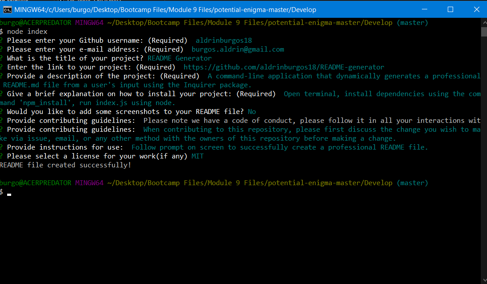

# README Generator
  
## Description
A command-line application that dynamically generates a professional README.md file from a user's input using the Inquirer package.  
  
**Link to deployed application:** [https://github.com/aldrinburgos18/README-generator](https://github.com/aldrinburgos18/README-generator)

## Table of Contents
- [Installation](#installation)
- [Usage](#usage)
- [Contributing](#contributing)
- [Questions](#questions)
- [License](#license)

## Installation
Open terminal, install dependencies using the command 'npm install', then run index.js using node.

## Usage
Follow prompt on screen to successfully generate a professional README.md file.

## Contributing
When contributing to this repository, please first discuss the change you wish to make via issue, e-mail, or any other method with the owners of this repository before making any changes.

## Questions
If you have any additional questions, please feel free to contact me at:  
E-mail: burgos.aldrin@gmail.com  
Github: [aldrinburgos18](https://github.com/aldrinburgos18)

## License
  
A short and simple permissive license with conditions only requiring preservation of copyright and license notices. Licensed works, modifications, and larger works may be distributed under different terms and without source code.  
*[More Information about this license...](https://opensource.org/licenses/MIT)*
